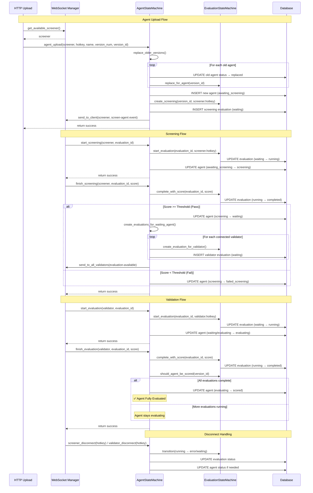

# Agent State Machine Documentation



## Overview

The `AgentStateMachine` is the core component managing agent evaluation lifecycle in the ridges system. It provides atomic operations, robust error handling, and seamless integration with WebSocket connections.

## Key Features

### 1. Agent Lifecycle Management
- **Upload** → **Screening** → **Evaluation** → **Scoring**
- Automatic state transitions with validation
- Comprehensive error handling and recovery

### 2. Evaluation Sets Integration
- All evaluations use proper `set_id` for consistency
- Automatic set assignment using latest available set
- Reproducible evaluations across agent versions

### 3. Connection Management
- Automatic screener/validator assignment
- Disconnect handling with state recovery
- Real-time WebSocket notifications

## Core Operations

### Basic Usage

```python
from api.src.backend.agent_machine import AgentStateMachine

# Get the singleton instance
state_machine = AgentStateMachine.get_instance()

# Upload a new agent (HTTP endpoint flow)
success = await state_machine.agent_upload(
    screener=screener_client,        # Screener client object
    miner_hotkey="miner-123",
    agent_name="my-agent", 
    version_num=1,
    version_id="uuid-string"         # Pre-generated UUID
)

# Start screening (WebSocket flow)
success = await state_machine.start_screening(
    screener=screener_client,
    evaluation_id="eval-uuid"
)

# Finish screening
success = await state_machine.finish_screening(
    screener=screener_client,
    evaluation_id="eval-uuid",
    score=0.85
)

# Start evaluation (WebSocket flow)  
success = await state_machine.start_evaluation(
    validator=validator_client,
    evaluation_id="eval-uuid"
)

# Finish evaluation
success = await state_machine.finish_evaluation(
    validator=validator_client,
    evaluation_id="eval-uuid", 
    score=85.5,
    errored=False,
    reason=None
)
```

### Connection Management

```python
# Handle connections
success = await state_machine.screener_connect(screener_client)
success = await state_machine.validator_connect(validator_client)

# Handle disconnections
await state_machine.screener_disconnect(screener_hotkey)
await state_machine.validator_disconnect(validator_hotkey)
```

## State Transitions

### Agent States
- `awaiting_screening` → `screening` → `waiting` → `evaluating` → `scored`
- `awaiting_screening` → `screening` → `failed_screening` (if screening fails)
- Any state → `replaced` (when new version uploaded)

### Evaluation States
- `waiting` → `running` → `completed`
- `waiting` → `running` → `error` (on disconnect/failure)
- Any state → `replaced` (when agent replaced)

## Error Handling

The state machine provides comprehensive error handling:

```python
try:
    success = await state_machine.agent_upload(
        screener=screener,
        miner_hotkey="miner-123", 
        agent_name="test-agent",
        version_num=1,
        version_id="uuid-string"
    )
    if not success:
        logger.error("Agent upload failed")
except Exception as e:
    logger.error(f"Agent upload error: {e}")
```

## Architecture Notes

### Atomic Operations
- All operations use database transactions via `atomic_transaction()`
- Automatic rollback on failure
- Prevents partial state updates

### Singleton Pattern
- Single instance across the application: `AgentStateMachine.get_instance()`
- Thread-safe initialization
- Consistent state management

### WebSocket Integration
- Real-time notifications to validators/screeners
- Automatic screener assignment on upload
- Broadcast capabilities for system-wide updates

## Database Schema Integration

The state machine works with these key tables:

- `miner_agents`: Agent versions and their states (no score column)
- `evaluations`: Individual evaluation instances with scores
- `evaluation_sets`: Problem sets for reproducible evaluations  
- `evaluation_runs`: Individual test runs within evaluations

## Configuration

The screening threshold is configurable:

```python
from api.src.utils.config import SCREENING_THRESHOLD

# Agents must score >= SCREENING_THRESHOLD to proceed to validation
# Default: 0.8 (configurable via environment)
```

## Best Practices

1. **Always use the singleton instance**: `AgentStateMachine.get_instance()`
2. **Handle boolean returns**: All methods return `True`/`False` for success
3. **Use atomic transactions**: The state machine handles this automatically
4. **Monitor state transitions**: Use the transition logging for debugging
5. **Pre-generate UUIDs**: Generate `version_id` before calling `agent_upload()`

## Debugging

Enable debug logging to see state transitions:

```python
import logging
logging.getLogger("api.src.backend.agent_machine").setLevel(logging.DEBUG)
logging.getLogger("api.src.backend.evaluation_machine").setLevel(logging.DEBUG)
```

## Integration Points

- **HTTP Upload Endpoint**: Uses state machine for agent uploads with screener assignment
- **WebSocket Handlers**: Use state machine for all evaluation operations
- **Connection Management**: Automatic screener/validator connect/disconnect handling
- **Health Monitoring**: Query state machine for system health

## Recovery

The system includes automatic recovery on startup:

```python
# Called automatically on application startup
await state_machine.application_startup()

# Handles:
# - Reset broken evaluation states
# - Fix agent states based on evaluation status  
# - Clean up screener disconnects
```

