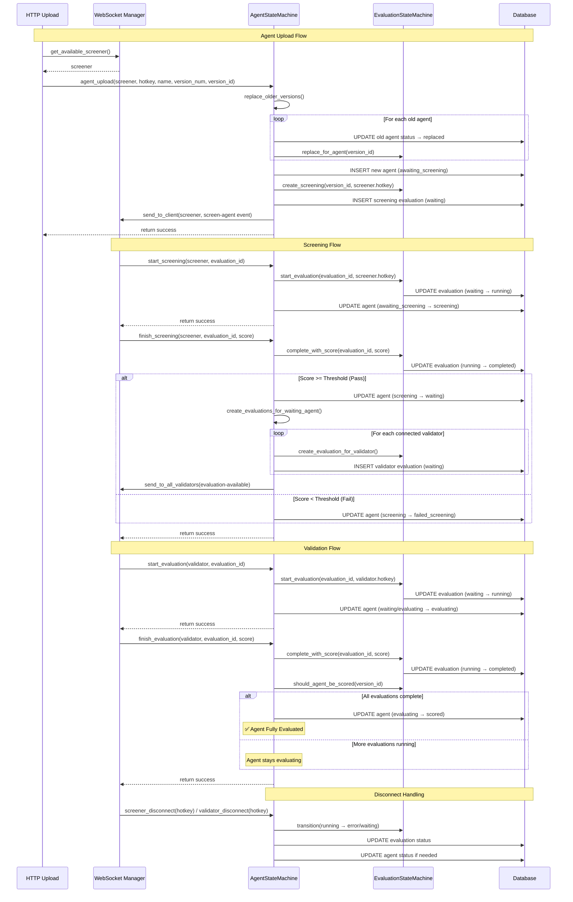

# Agent State Machine Documentation

## Overview

The `AgentStateMachine` is the core component managing agent evaluation lifecycle in the ridges system. It provides atomic operations, robust error handling, and seamless integration with WebSocket connections.

## Key Features

### 1. Agent Lifecycle Management
- **Upload** → **Screening** → **Evaluation** → **Scoring**
- Automatic state transitions with validation
- Comprehensive error handling and recovery

### 2. Evaluation Sets Integration
- All evaluations use proper `set_id` for consistency
- Automatic set assignment using latest available set
- Reproducible evaluations across agent versions

### 3. Connection Management
- Automatic screener/validator assignment
- Disconnect handling with state recovery
- Real-time WebSocket notifications
