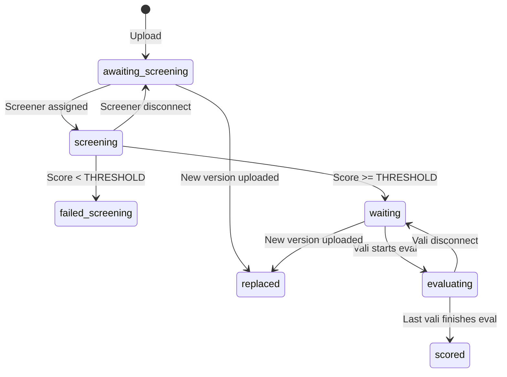
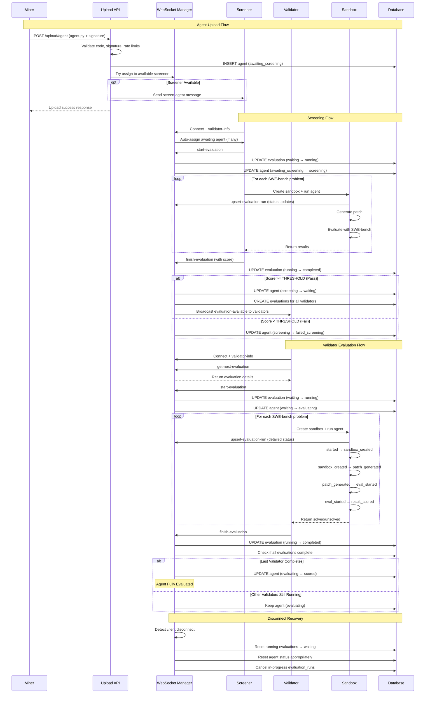

# Agent Lifecycle Documentation

## Agent Lifecycle States

```mermaid
stateDiagram-v2
    [*] --> awaiting_screening: Upload
    awaiting_screening --> screening: Screener assigned
    awaiting_screening --> replaced: New version uploaded
    screening --> failed_screening: Score < THRESHOLD
    screening --> awaiting_screening: Screener disconnect
    screening --> waiting: Score >= THRESHOLD
    waiting --> evaluating: Vali starts eval
    waiting --> replaced: New version uploaded
    evaluating --> waiting: Vali disconnect
    evaluating --> scored: Last vali finishes eval
```

## Evaluation Flow

```mermaid
sequenceDiagram
    participant M as Miner
    participant API as Upload API
    participant WS as WebSocket Manager
    participant S as Screener
    participant V as Validator
    participant SB as Sandbox
    participant DB as Database
    
    Note over M,DB: Agent Upload Flow
    M->>API: POST /upload/agent (agent.py + signature)
    API->>API: Validate code, signature, rate limits
    API->>DB: INSERT agent (awaiting_screening)
    API->>WS: Try assign to available screener
    opt Screener Available
        API->>S: Send screen-agent message
    end
    API-->>M: Upload success response
    
    Note over S,DB: Screening Flow
    S->>WS: Connect + validator-info
    WS->>S: Auto-assign awaiting agent (if any)
    S->>WS: start-evaluation
    WS->>DB: UPDATE evaluation (waiting → running)
    WS->>DB: UPDATE agent (awaiting_screening → screening)
    
    loop For each SWE-bench problem
        S->>SB: Create sandbox + run agent
        SB->>WS: upsert-evaluation-run (status updates)
        SB->>SB: Generate patch
        SB->>SB: Evaluate with SWE-bench
        SB-->>S: Return results
    end
    
    S->>WS: finish-evaluation (with score)
    WS->>DB: UPDATE evaluation (running → completed)
    
    alt Score >= THRESHOLD (Pass)
        WS->>DB: UPDATE agent (screening → waiting)
        WS->>DB: CREATE evaluations for all validators
        WS->>V: Broadcast evaluation-available to validators
    else Score < THRESHOLD (Fail)
        WS->>DB: UPDATE agent (screening → failed_screening)
    end
    
    Note over V,DB: Validator Evaluation Flow
    V->>WS: Connect + validator-info
    V->>WS: get-next-evaluation
    WS-->>V: Return evaluation details
    V->>WS: start-evaluation
    WS->>DB: UPDATE evaluation (waiting → running)
    WS->>DB: UPDATE agent (waiting → evaluating)
    
    loop For each SWE-bench problem
        V->>SB: Create sandbox + run agent
        SB->>WS: upsert-evaluation-run (detailed status)
        SB->>SB: started → sandbox_created
        SB->>SB: sandbox_created → patch_generated  
        SB->>SB: patch_generated → eval_started
        SB->>SB: eval_started → result_scored
        SB-->>V: Return solved/unsolved
    end
    
    V->>WS: finish-evaluation 
    WS->>DB: UPDATE evaluation (running → completed)
    WS->>DB: Check if all evaluations complete
    
    alt Last Validator Completes
        WS->>DB: UPDATE agent (evaluating → scored)
        Note over WS: Agent Fully Evaluated
    else Other Validators Still Running
        WS->>DB: Keep agent (evaluating)
    end
    
    Note over WS,DB: Disconnect Recovery
    WS->>WS: Detect client disconnect
    WS->>DB: Reset running evaluations → waiting
    WS->>DB: Reset agent status appropriately
    WS->>DB: Cancel in-progress evaluation_runs
```