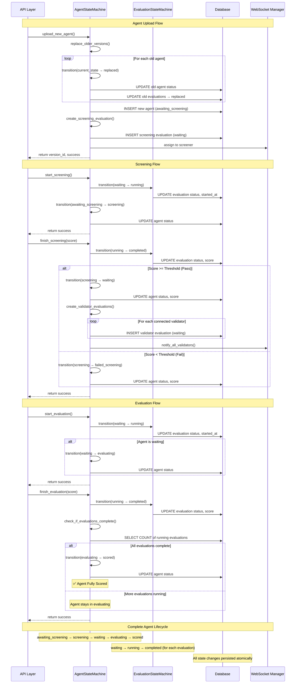

# State Machine Documentation



## Overview

The `EvaluationStateMachine` is the core component managing agent evaluation lifecycle in the ridges system. It provides atomic operations, perfect error handling, and seamless integration with the evaluation sets system.

## Key Features

### 1. Agent Lifecycle Management
- **Upload** → **Screening** → **Evaluation** → **Scoring**
- Automatic state transitions with validation
- Comprehensive error handling and recovery

### 2. Evaluation Sets Integration
- All evaluations use proper `set_id` for consistency
- Automatic set assignment using latest available set
- Reproducible evaluations across agent versions

### 3. Re-evaluation Triggers
- Individual agent re-evaluation
- Bulk re-evaluation capabilities
- Support for both screening and validation re-evaluation

## Usage Examples

### Basic Operations

```python
from api.src.backend.state_machine import get_state_machine

# Get the singleton instance
state_machine = get_state_machine()

# Upload a new agent
success = await state_machine.upload_new_agent(
    miner_hotkey="miner-123",
    agent_name="my-agent",
    version_num=1,
    screener_hotkey="screener-456"
)

# Start evaluation
success = await state_machine.start_evaluation(
    evaluation_id="eval-uuid",
    validator_hotkey="validator-789"
)

# Finish evaluation
success = await state_machine.finish_evaluation(
    evaluation_id="eval-uuid", 
    score=85.5
)
```

### Re-evaluation Triggers

```python
# Re-evaluate a specific agent
success = await state_machine.trigger_re_evaluation(
    version_id="agent-uuid",
    evaluation_type="validator"  # or "screener"
)

# Bulk re-evaluation
count = await state_machine.trigger_bulk_re_evaluation(
    miner_hotkey="miner-123",  # Optional: filter by miner
    evaluation_type="validator"
)
```

### State Validation

```python
# Check if transition is valid
is_valid = state_machine.validator.is_valid_transition(
    current_state=AgentStatus.waiting,
    next_state=AgentStatus.evaluating,
    entity_type="agent"
)

# Get valid next states
valid_states = state_machine.validator.get_valid_next_states(
    current_state=AgentStatus.screening,
    entity_type="agent"
)
```

## State Transitions

### Agent States
- `awaiting_screening` → `screening` → `waiting` → `evaluating` → `scored`
- `awaiting_screening` → `screening` → `failed_screening` (if screening fails)
- Any state → `replaced` (when new version uploaded)

### Evaluation States
- `waiting` → `running` → `completed` → `replaced`
- `waiting` → `running` → `error` → `replaced`
- `waiting` → `running` → `error` (with termination_reason='timed out') → `replaced`

## Error Handling

The state machine provides comprehensive error handling:

```python
try:
    success = await state_machine.upload_new_agent(...)
except ValidationError as e:
    # Handle validation errors
    logger.error(f"Validation failed: {e}")
except ConcurrencyError as e:
    # Handle concurrent operation conflicts
    logger.error(f"Concurrency error: {e}")
```

## Architecture Notes

### Atomic Operations
- All operations use database transactions
- Automatic rollback on failure
- Prevents partial state updates

### Singleton Pattern
- Single instance across the application
- Thread-safe initialization
- Consistent state management

### Websocket Integration
- Real-time notifications to validators/screeners
- Automatic notification on state changes
- Broadcast capabilities for system-wide updates

## Database Schema Integration

The state machine works with these key tables:

- `miner_agents`: Agent versions and their states
- `evaluations`: Individual evaluation instances with set_id
- `evaluation_sets`: Problem sets for reproducible evaluations
- `evaluation_runs`: Individual test runs within evaluations

## Best Practices

1. **Always use the singleton instance**: `get_state_machine()`
2. **Handle errors appropriately**: Wrap operations in try-catch blocks
3. **Use atomic transactions**: The state machine handles this automatically
4. **Monitor state transitions**: Use the transition logging for debugging
5. **Validate states**: Use the built-in validator for state checks

## Debugging

Enable debug logging to see state transitions:

```python
import logging
logging.getLogger("api.src.backend.state_machine").setLevel(logging.DEBUG)
```

## Integration Points

- **Socket Handlers**: Use state machine for all evaluation operations
- **Upload Endpoints**: Use state machine for agent uploads
- **Scoring System**: Use state machine for score updates
- **Health Monitoring**: Query state machine for system health

